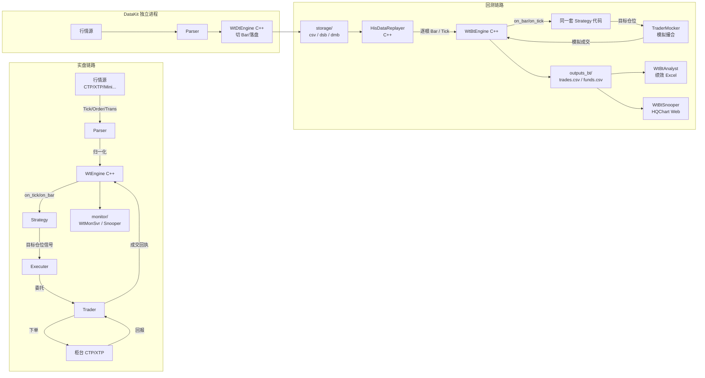

## 核心心智模型

**wtpy 就是一条流水线**：行情进来 → 被切成 Bar/Tick → 触发策略 → 策略给出目标仓位 → 执行器落成委托 → 经过交易通道到柜台 → 再把成交 / 持仓 / PnL 回到监控服务。实盘和回测只是**这条流水线的"水源"不同**：实盘水源是实时行情 + 真实撮合；回测水源是历史文件 + 模拟撮合。

## 整体数据流（mermaid）



核心认知：
1. **策略代码在实盘和回测里长一样**（都继承 `BaseCtaStrategy`），只是被"谁"喂数据不同。
2. **Executer vs Trader**：Executer 是"把目标仓位 → 委托"的算法层（TWAP/VWAP/diff 差额下单等）；Trader 是"把委托 → 柜台协议包"的通道层。前者做"怎么下"的决策，后者做"怎么发"的通信。
3. **DataKit 是独立进程**：`demos/datakit_stk/runDT.py` 通常常驻 7×24 采集；回测读的 csv/dsb 就是它落的盘。

## 实盘链路分层

```
Parser  → WtEngine → Strategy → Executer → Trader → Broker
(适配)   (调度)      (决策)     (执行)     (通道)   (柜台)
```

在 `demos/cta_stk/` 目录下，每一层对应一个 yaml：
- `tdparsers.yaml` → Parser 配置
- `config.yaml`    → WtEngine 主配置（引用其它 yaml）
- `Strategies/*`   → Strategy 代码
- `executers.yaml` → Executer 算法与参数
- `tdtraders.yaml` → Trader 柜台接入
- `filters.yaml` / `actpolicy.yaml` → 信号/动作过滤与节流

详情见 [实盘运行与配置](../07-实盘与监控/实盘运行与配置.md)。

## 回测链路分层

```
storage/csv|dsb → HisDataReplayer → WtBtEngine → Strategy → TraderMocker
                                                      ↓
                                              outputs_bt/
                                                      ↓
                                    WtBtAnalyst / WtBtSnooper
```

在 `demos/cta_stk_bt/configbt.yaml` 里：
- `env.mocker: cta` → 选择股票模拟器（处理 T+1 等规则）
- `replayer.basefiles.{commodity,contract,holiday,session}` → 基础数据
- `replayer.mode: csv` + `replayer.path: ../storage/` → 数据来源
- `replayer.stime / etime` → 回测时间窗
- `replayer.fees` → 股票手续费/印花税表

详情见 [回测流程与配置](../06-回测/回测流程与配置(configbt.yaml).md)。

## Engine vs Wrapper vs Strategy 三层

- **Wrapper 层（Python）**：`wtpy/wtpy/wrapper/Wt{Bt,,Dt}Wrapper.py`，每个都是 `ctypes` 加载 dll/so 的单例。只做"符号表 + 类型转换"，无业务。
- **Engine 层（Python 门面）**：`wtpy/wtpy/Wt{Bt,,Dt}Engine.py`，给用户写 `engine.init / configBacktest / set_cta_strategy / run_backtest` 之类"顺手"的 API。
- **Strategy 层（用户 Python）**：`BaseCtaStrategy` 子类，实现 `on_init/on_bar/on_tick/...`。

策略里拿到的 `context` 对象（`CtaContext` 等）是 wrapper 层在 C++ 回调 Python 时构造出来的，用于暴露"取历史 K 线 / 设置目标仓位 / 查持仓"等 API。

## 监控/分析回流

```
实盘：WtEngine → UDP 事件 → EventReceiver → DataMgr → WtMonSvr (HTTP/WS) → 浏览器
回测：outputs_bt/ → WtBtAnalyst.Calculate → summary.json + Excel → WtBtSnooper → 浏览器
```

详见 [monitor 监控服务](../07-实盘与监控/monitor监控服务.md) 和 [WtBtSnooper 可视化](../06-回测/WtBtSnooper可视化.md)。

## 下一步

- Python ↔ C++ 边界的具体机制：[Python与C++的边界](./Python与C++的边界.md)
- 三种引擎的调度粒度差异：[三类策略引擎概览](../03-引擎/三类策略引擎概览(CTA-HFT-SEL).md)
